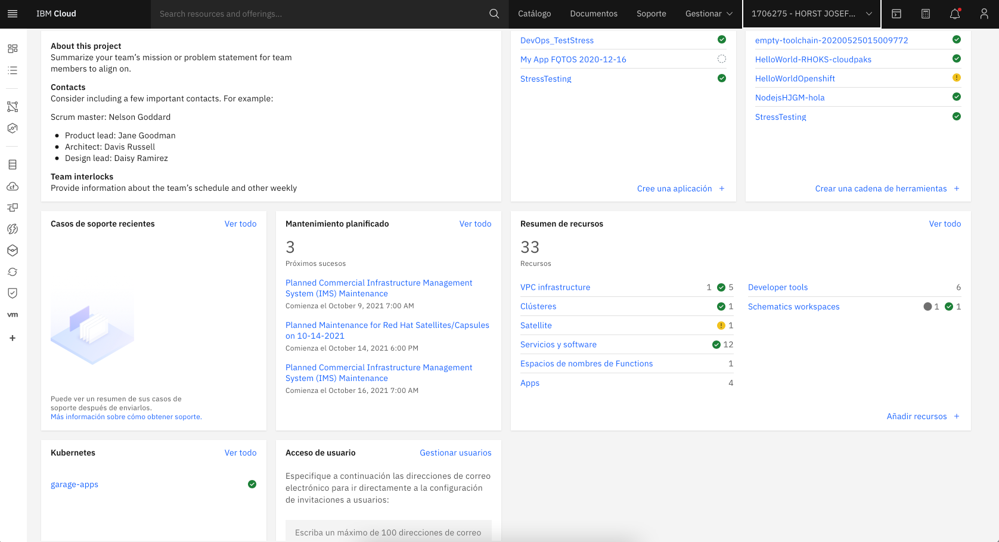
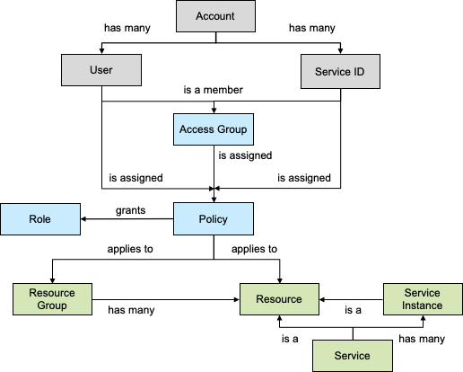

# Introducción a la consola de IBM Cloud
## Lo que aprenderas de este lab:
En este lab aprenderás sobre la  experiencia que ofrece la plataforma de IBM Cloud y sus capacidades. Así mismo podrás observar como funciona el modelo de IAM.

## Lo que necesitarás
- Una cuenta de IBM Cloud.
## Video a seguir
[Link a box](https://ibm.ent.box.com/file/866835907714)
## Pasos a seguir
### 1. Ingresa a la [consola](https://cloud.ibm.com) de IBM Cloud 
En caso de no contar con una cuenta puedes crear una gratuita. Recuerda que existen 3 tipos de cuenta Lite, Pay as you go y Suscripción. 
En la modalidad de Lite jamás te pedirá una tarjeta de crédito.

### 2. Dentro de la consola, explora el menu de tipos de recursos que se encuentra de lado izquierdo
Esto es parte de la experiencia enfocada en soluciones que ofrece IBM Cloud. Encontraras secciones enfocadas en tipos de servicios, modelos de cómputo y más!

### 3. En la parte superior encontrarás una barra de búsqueda 
Con esta barra puedes realizar búsquedas de servicios 
o simplemente buscar instancias de servicios por su nombre o con base a etiquetas.

### 4. En la misma parte superior derecha observarás varias opciones
- **Catálogo:** Explorar más de los 190 servicios disponibles en la plataforma. 
- **Documentos:** Encontrarás documentación sobre cada uno de los servicios así como tutoriales.
- **Soporte:** En caso que tengas algún problema técnico con uno de los servicios y requieras crear un ticket de soporte. 
- **Gestionar:** Administrar límites de facturación, accesos y permisos (IAM).

### 5. Panel de recursos
Al centro encontrarás diferentes paneles personalizables para poder monitorear y observar los recursos instanciados en tu cuenta o a nivel grupo de recursos. 

### 6. Explora el modelo de IAM.
A continuación te muestro una imagen de referencia con la estructura del modelo de Identity Access Management (IAM - Administración de Identidad y Acceso)

## Conclusiones
En este laboratorio pudimos observar como funciona la plaforma de IBM Cloud y sus capacidades. Así mismo aprendidos sobre el funcionamiento del modelo de IAM.

## Links de interes
- [Consola de IBM Cloud](https://cloud.ibm.com)
