#  Introducción a la consola de Openshift
## Lo que aprenderas de este lab:
Con este laboratorio aprenderás sobre las experiencias que ofrece la consola de Openshift. 
 - [x] Como acceder desde IBM Cloud a la consola de OpenShift
 - [x] Cambiar entre vistas de Administrador y Desarrollador
 - [x] Crear diferentes recursos a través de Operadores y o la opción de agregar recursos. 
 - [x] Revisar diferentes componentes sus respectivos YAML y Logs
## Lo que necesitarás
  - [ ] Una cuenta de IBM Cloud
  - [ ] Un Cluster de Openshift
## Video a seguir

## Pasos a seguir

### 1- Accediendo a la consola de Openshift
1. Dentro del portal de [IBM Cloud](https://cloud.ibm.com) puedes ingresar a la lista de recursos para localizar
tu cluster de Openshift (recuerda acceder al cluster que se te asignó, puedes consultar las asignaciones[aquí](https://github.com/joeg1307/bootcamp#asignaciones-de-espacios-y-puertos).
2. Da click en tu cluster y serás redireccionado a una vista como la siguiente:
  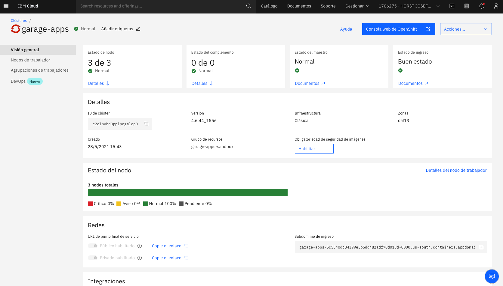
  En esta sección podrás ver el cluster de Openshift pero desde la perspectiva de IBM Cloud, por lo que verás más información relacionada a la
  infraestructura del mismo cluster y la salud en general del mismo cluster.
3. En la parte superior derecha verás una opción que dice "Consola Web de OpenShift" da click en ella para entrar a la `consola del cluster`.

### 2- Conociendo las experiencias para Administrador y para desarrollador
Openshift ofrece 2 experiencias principales para sus usuarios; una para desarrolladores y otra para administradores.
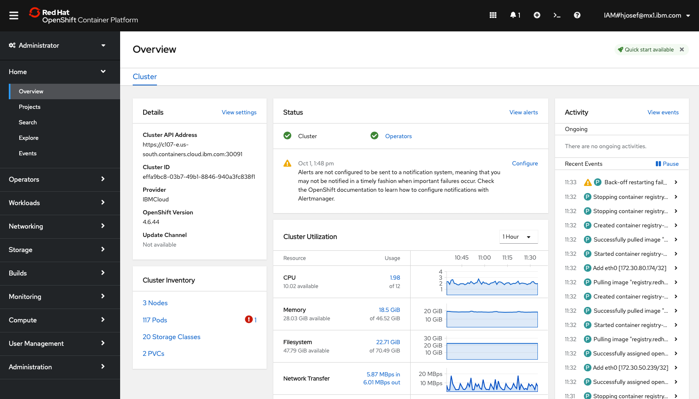
Puedes intercambiar entre ambas al dar click en el botón de la esquina superior izquierda:
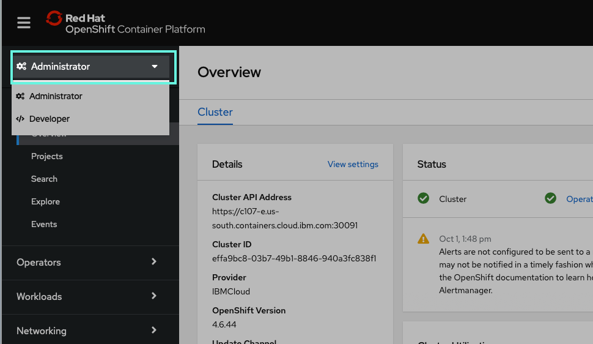

#### Las prinicipales diferencias 
Como podrás observar que la principal diferencia es que tienen menús diferentes, esto es debido a que cada tipo de usuario tiene tareas diferentes que realizar. 
OpenShift busca facilitar realizar dichas tareas, por lo que para la experiencia de desarrollador podrás encontrar vistas para. monitorerar tus despliegues, 
revisar la topología de tu aplicación, todo enfocado a tu aplicación. 
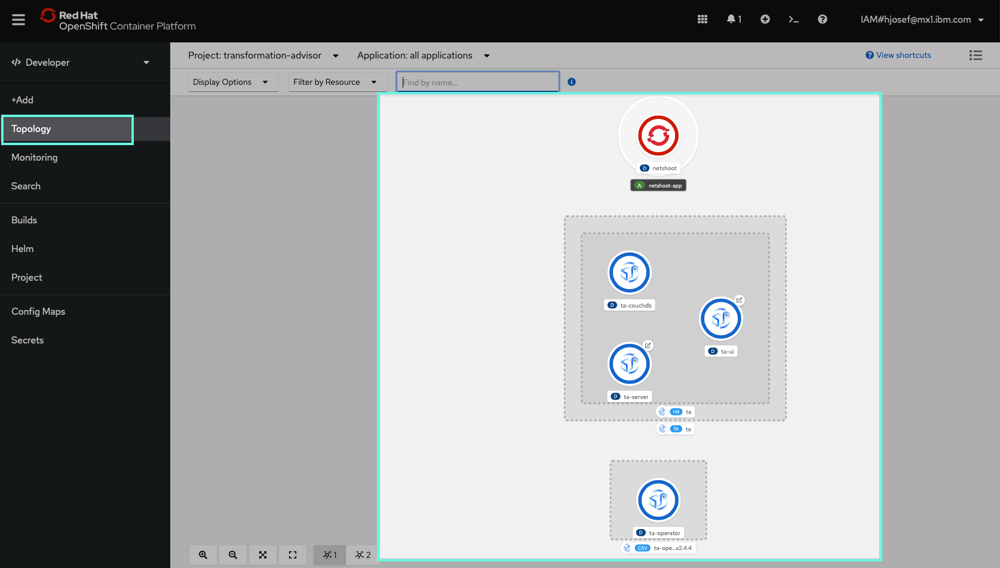

En cuanto a la perspectiva de administrador podrás encontrar vistas más enfocadas a realizar tareas de administración y mantenimiento del propio cluster.
Tareas como instalación de operadores, almancemanmiento, manejo de usuarios, etc.
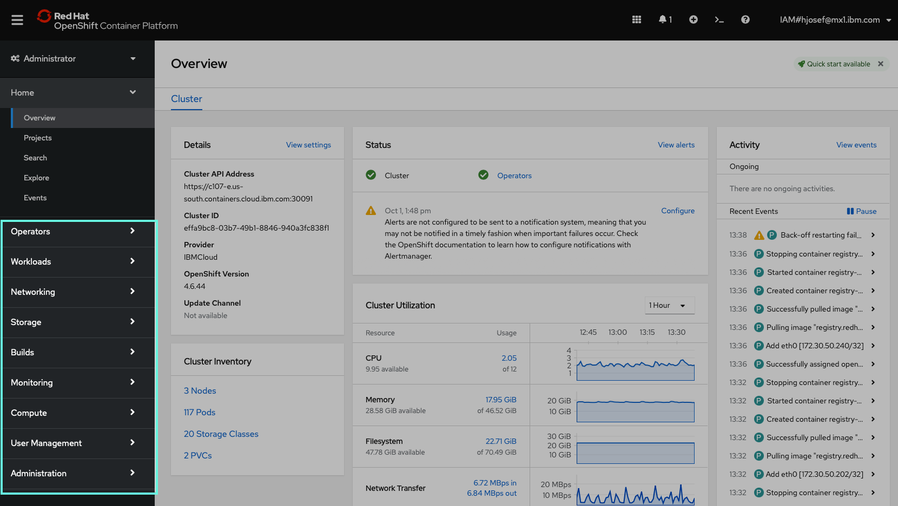

### 3- Creando recursos
Dentro de OpenShift se pueden crear diferentes tipos de recursos ya sean de Kuberentes o de OpenShift. 
Una forma de crearlos es a través del icono de `+` en la parte superior e ingresando en YAML del recurso a crear.
Otra forma es través de la línea de comandos, la cual puedes utilizar y autenticarte a través del comando que muestra en la consola en la sección de tu usuario.
Desde la versión 4 de OpenShift se introdujeron los `Operators` u operadores en español. Prácticamente los operadores nos permiten crear Operadores, los cuales
funcionan como plantillas, para crear instancias dentro del cluster. Muy similar al catálogo de IBM Cloud que vimos en el laboratorio anterior. 

Vamos a crear un recurso. 
1. Vamos a la vista de desarrollador  
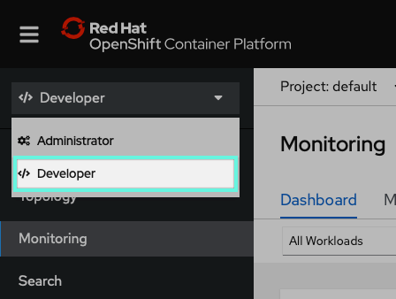
2. Damos click en `+Add`.
   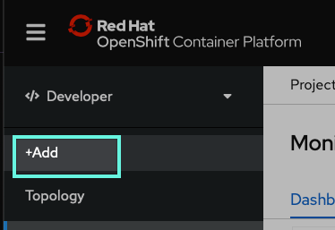
3. Asegurate que estas en el proyecto `default` y luego da click en `Catalog`.
   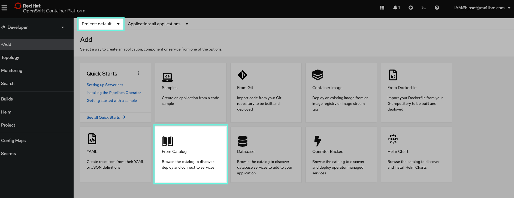
4. En este catálogo encontrarás una gran variedad de recursos para crear dentro de tu cluster. Da click en `Apache HTTP Server`con la etiqueta `Template`.
   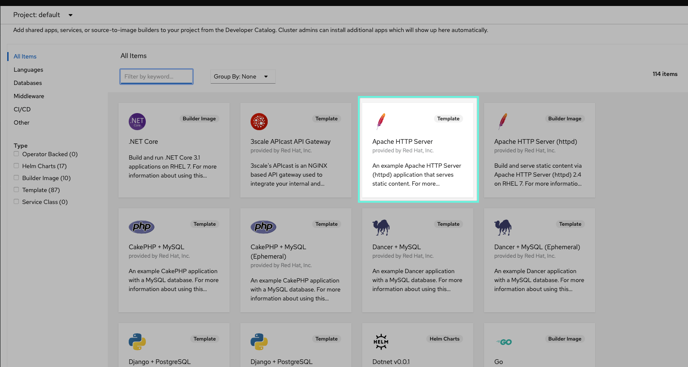
5. Da click en `Instantiate Template`   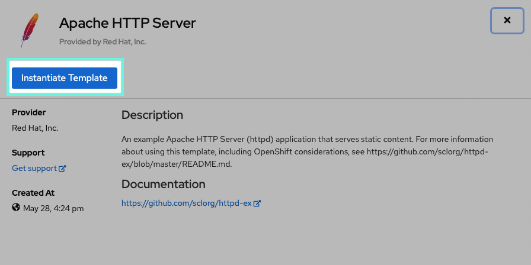
6. En esta vista podrás parametrizar la creación de la instancia por el momento deja todo como esta y luego da click en `Create`   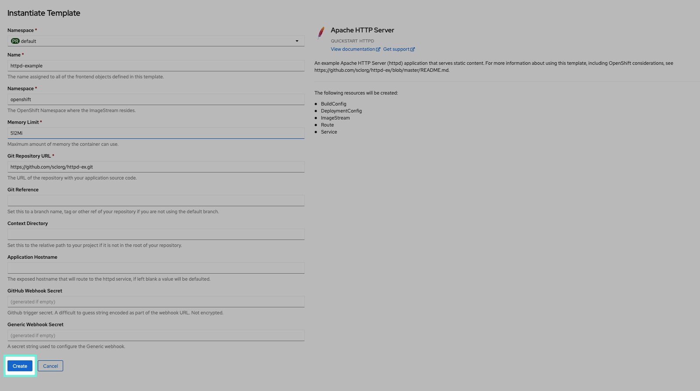
7. Notarás que te redireccionará automáticamente a la vista de topología en ella podras observar que se ha creato un nuevo recurso que corresponde a la instancia que acabas de solicitar a OpenShift que la cree.  Haz un click sobre ese icono para que muestre más información contextual del despliegue y los recursos de OpenShift que fueron creados.  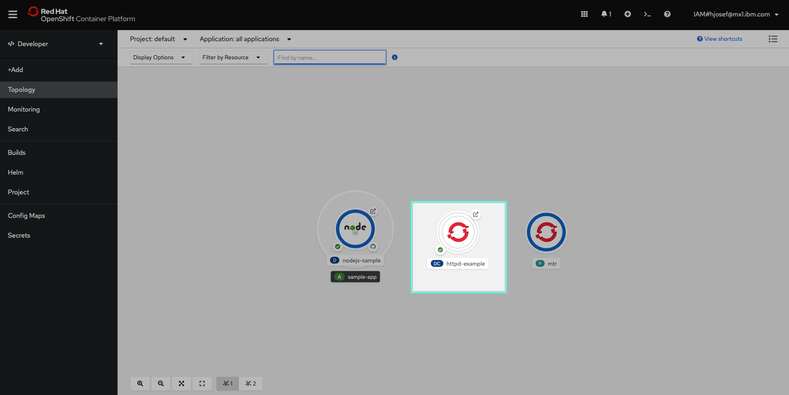
8. En este nuevo panel podrás observar que OpenShift ha creado tanto el `pod`, `build`, `servicio` y una `ruta` para acceder a ella.   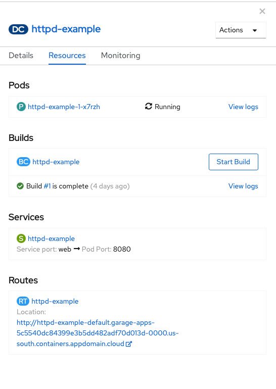
9. Por último da click en la ruta o tambien puede hacer en el icono de enlace externo desde la vista de topología.   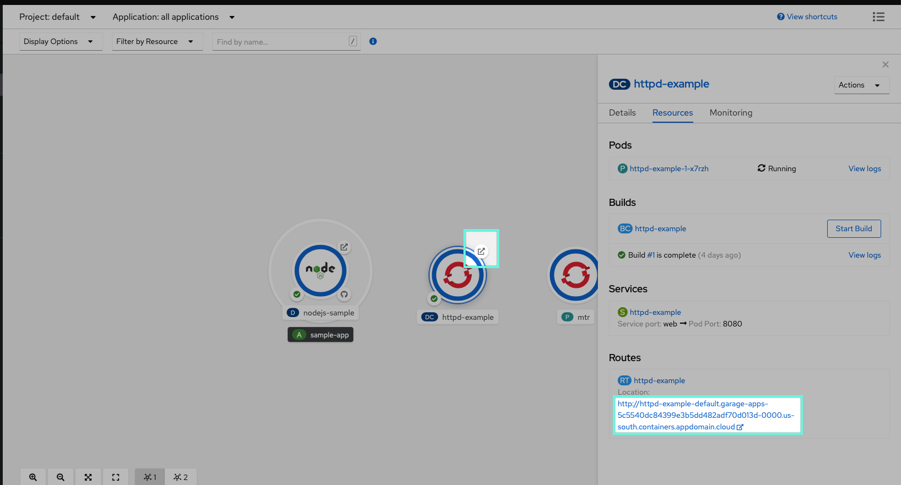
  Felicidades! Haz creado un primer recurso en OpenShift, se debería ver algo como se ve en la siguiente imagen.  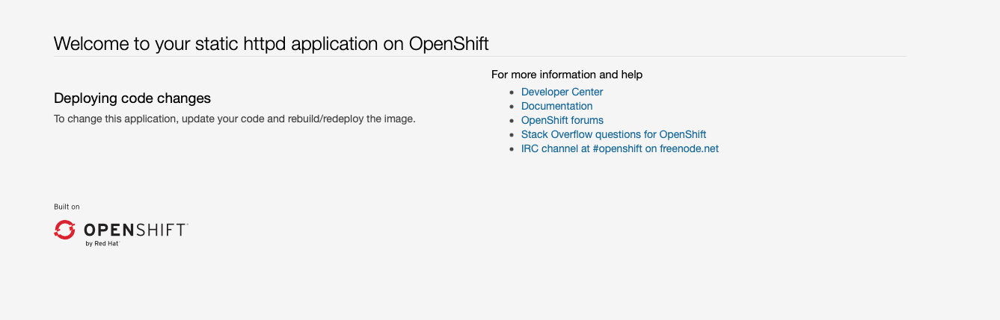

### 4- Revisar diferentes componentes sus respectivos YAML y Logs
Partiendo del panel de la sección anterior. Recuerda que en esta vista de rápido acceso puedes acceder a los recursos correspondientes a este despliegue.  

1. Da click en el nombre del `pod`   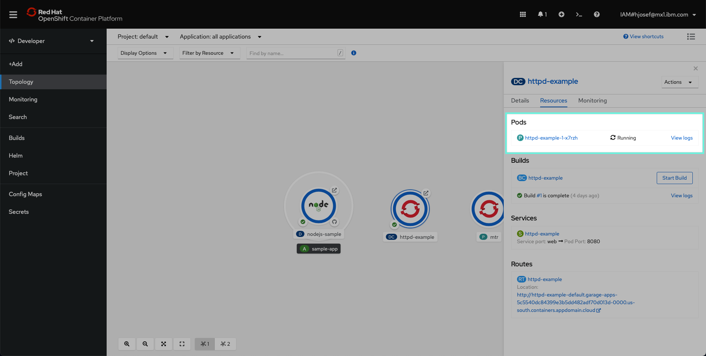
2. En esta vista del pod, podrás observar lo siguiente:
 2. El estatus actual del Pod
 2. Un menú de opciones para inspeccionar más a detalle el `Pod`
 2. Gráficas de monitoreo del Pod.
 2. Un menú de opciones para poder operar el `Pod`. Opciones como Eliminar o Editar enlínea el `Pod` (YAML)
  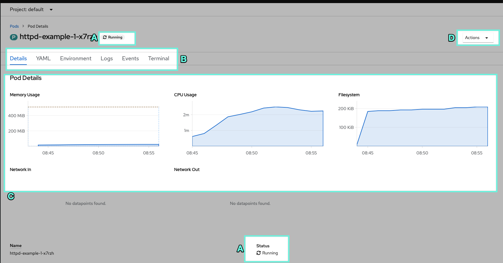
3. Da click en el menú de opciones en al opción de `Terminal`
4. Da click ahora en la opción de YAML 

 ## Conclusiones

## Links de interes
