#  Introducción al servicio de Functions 
## Lo que aprenderás de este lab:
Con este laboratorio aprenderás como crear una función y acceder a ella mediante un gateway. 
 - [x] Como crear una acción desde la interfaz web de IBM cloud
 - [x] Activar la función como una web action
 - [x] Conectar la función con API Gateway
 - [x] Hacer peticiones a nuestra API
## Lo que necesitarás
  - [ ] Una cuenta de IBM Cloud
  - [ ] Una terminal abierta
## Video a seguir
[Link a video](https://ibm.box.com/s/nni9bbk4arqtqglg41iq41ionbjt9dqs)
## Pasos a seguir

### 1- Dentro de IBM Cloud 
1. Dentro del portal de [IBM Cloud](https://cloud.ibm.com) nos dirigimos a la barrita de la izquierda y daremos click en el icono de una F. Nos redirigirá al servicio de Functions dentro de IBM Cloud.

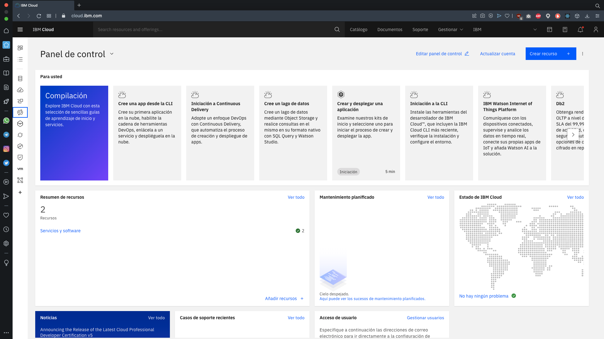

2. Una vez en la nueva pagina le daremos en el botón azul que indica **Empezar a crear** que nos llevará a la pagina donde podremos seleccionar que deseamos crear.

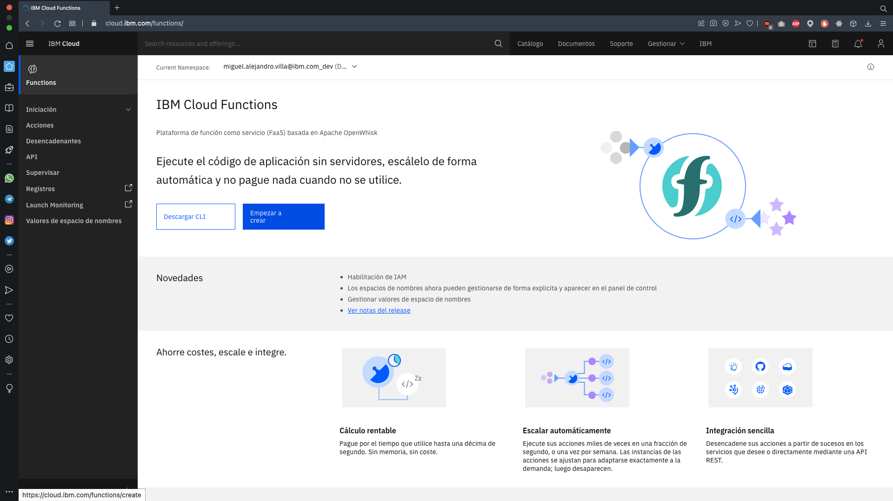

3. En esta ventana vemos que podemos crear acciones, triggers, secuencias, podemos comenzar con un template y podemos instalar algunos paquetes que lleguemos a necesitar en nuestro proyecto. En este caso tendremos que seleccionar **Action**.

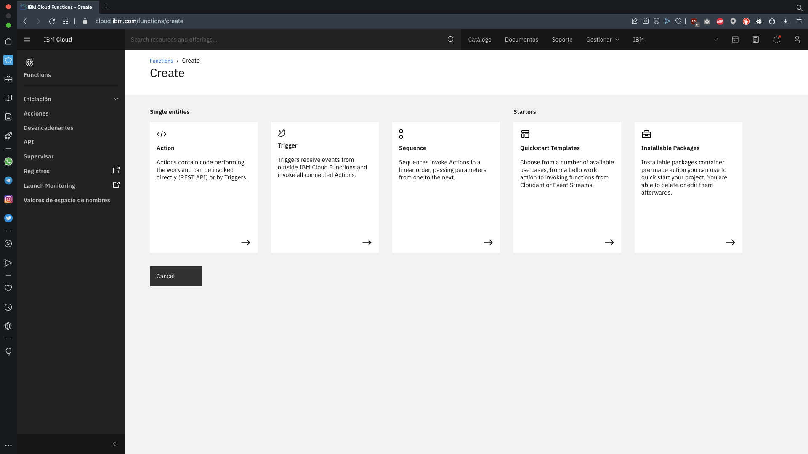

4. Es hora de crear nuestra acción (función), le pondremos un nombre en este caso usaremos **Calculadora**, dejaremos el package en **Default Package** y el runtime que usaremos será **Node.js 12**, en caso de crear una función en otro lenguaje podemos elegir de la lista el que queramos, también nos permite subir una imagen de Docker para poder tener algún lenguaje que IBM Cloud Functions no soporte por default. 

Una vez que estemos listos le daremos al botón azul que dice **Create**

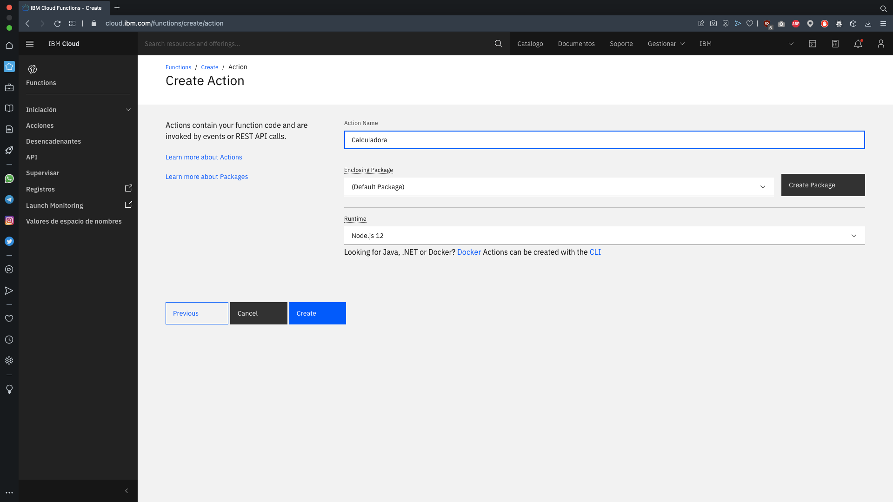

5. Lo primero que vemos en la siguiente ventana es código, ese código pertenece a nuestra función por lo tanto sería ese código el que se ejecute cada vez que nosotros llamemos a la función. Ahora deberemos modificar un poco el código agregando al mensaje la variable **params.name**

Podemos copiar y pegar el siguiente código o si prefieren editarlo ustedes mismos también está bien. una vez terminada la edición podemos darle al botón azul de la derecha que dice **Save**. Lo que hicimos es agregar al mensaje la variable **name** que viene en los parámetros de la petición, por lo tanto, ahora podemos recibir un nombre de la petición.
```bash
 function main(params) {
    return { message: `Hello World ${params.name}` };
}

```

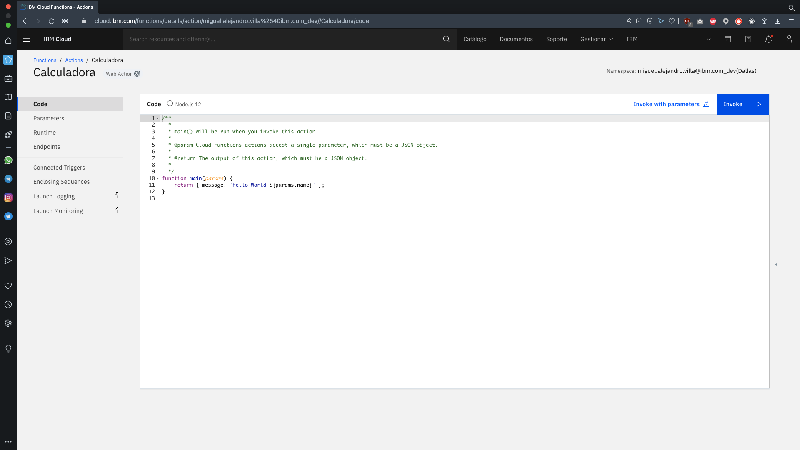

6. Una vez guardado el código daremos click al botón que dice **Invoke with parameters** el cual nos abrirá un pop up donde podremos simular con un JSON la entrada que tendrá nuestra función. En el recuadro blanco necesitaremos agregar el siguiente JSON editando nuestro `<nombre>` y daremos click al botón que dice **Apply**.
```bash
{
    "name":"<nombre>"
}
```

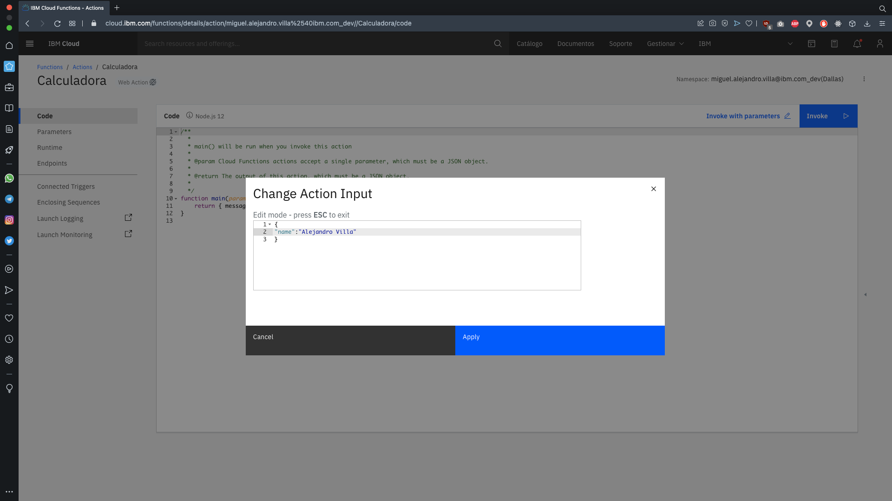

7. Al agregar los parámetros podremos simula la petición a nuestra función y ver que nos regresaría. Ahora podemos darle click al botón azul **Invoke** lo cual simulará una petición y nos regresará un ejemplo del resultado que obtendríamos.

Podremos ver como nuestra funcion nos regresa un JSON el cual contiene lo siguiente.
```bash
{
    "message": "Hello World <nombre>"
}
```

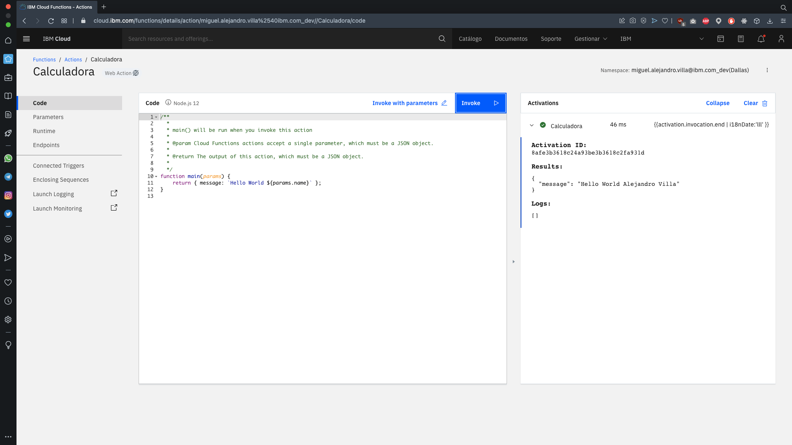

7. Ya probamos que nuestra función nos regresa lo que queríamos ahora activaremos el **Web Action** para poder acceder a nuestra función desde el internet, hacer esto será lo mas sencillo de esta practica nos dirigimos a **Endpoints** del lado izquierdo y activaremos el check que dice **Enable as Web Action**, daremos click al botón azul que está arriba a la derecha **Save** y con esto nos mostrará una URL la cual comienza con

```bash
https://us-south.functions.appdomain.cloud/api/v1/web/<user>/default/Calculadora
```

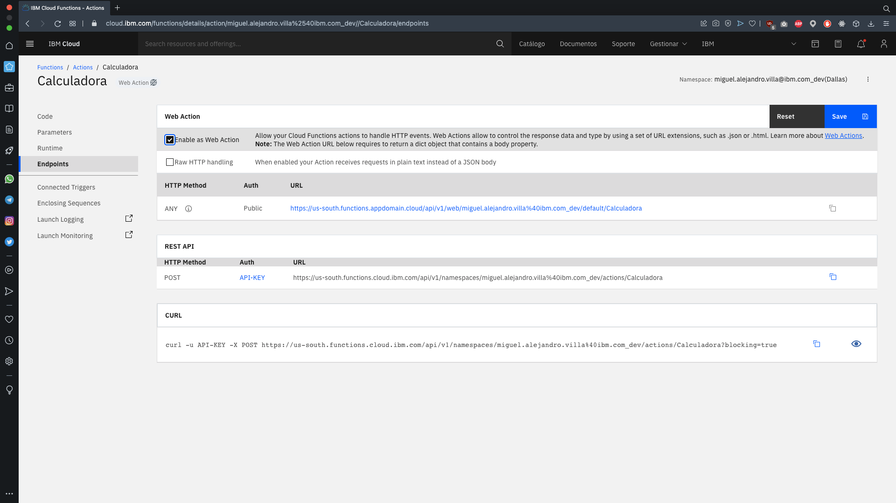

8. Copiamos la liga que nos da.

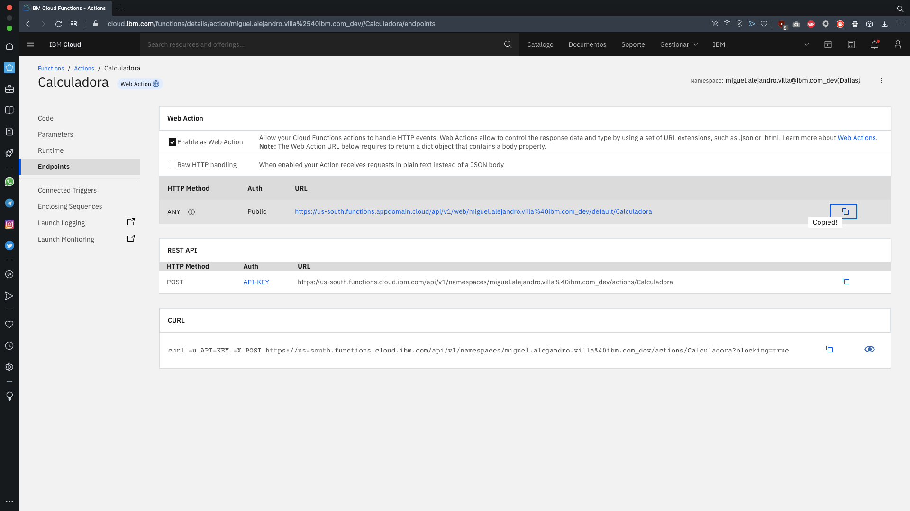

9. Con esa liga podremos hacer una petición a nuestra función, pero antes debemos modificar un poquito más el código. Agregaremos un tag que servirá de wrapper a nuestro mensaje ese tag será `body: {<nuestro-mensaje>}` el código debería de quedar de esta manera. El body será necesario para que nuestras peticiones nos arrojen la información que esperamos obtener que sería el mensaje. Recuerden darle al botón azul **Save** después de haber hecho la modificación del código para que los cambios se guarden.
```bash
 function main(params) {
    return { body: {message: `Hello World ${params.name}`}};
}
``` 

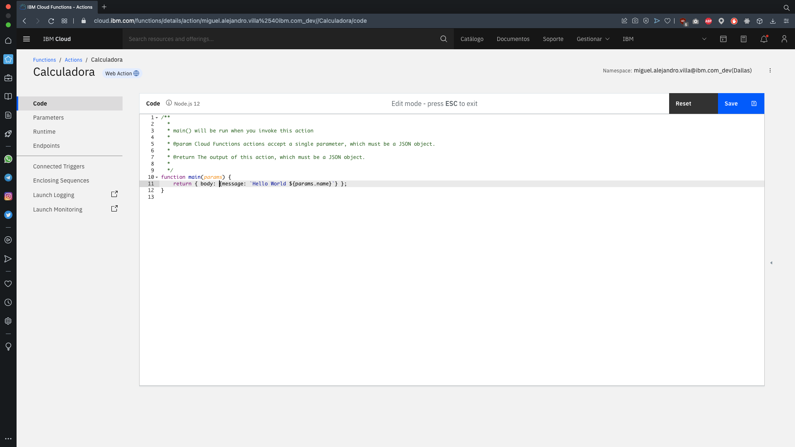

10. Con nuestro código modificado ahora procederemos a hacer la petición a nuestra función desde una terminal y pegamos el siguiente comando. Deben de editar `<URL>`y pegar la URL que nos arrojó al activar nuestro Web Action y editar también el `<nombre>` pongan el suyo o cualquier otro nombre.

```bash
curl -X POST "<URL>" -H 'Content-Type: application/json' -d '{"name":"<nombre>"'
```

Una vez editados estos 2 campos le damos enter y deberíamos obtener un resultado como el siguiente.

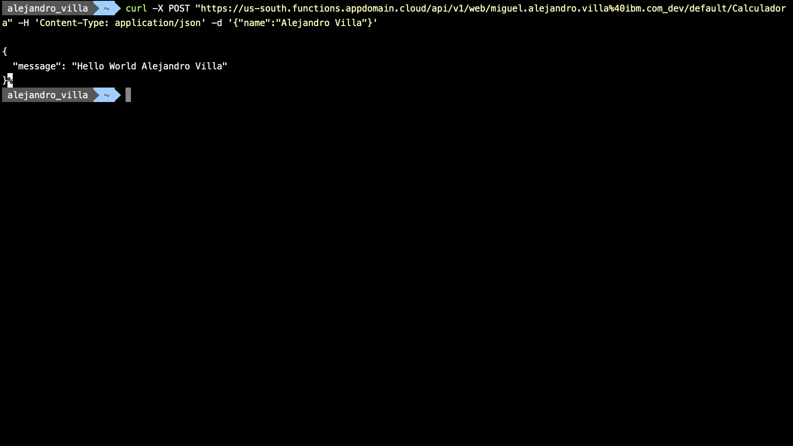

11. Después de haber probado nuestra función y haber visto que en efecto ya nos está regresando algo que nosotros hicimos, continuaremos con la parte de la calculadora, para esto copiaremos el siguiente código y sustituiremos el que tenemos en la función quedará de esta manera, recuerden siempre darle al botón azul de **Save** después de hacer cualquier edición del código.

```bash
function main(params) {
    let res = 0;
    switch (params.opt.toUpperCase()) {
        case "SUMA":
            res = parseInt(params.num1) + parseInt(params.num2);
            break;
        case "RESTA":
            res = parseInt(params.num1) - parseInt(params.num2);
            break;
        case "DIVIDE":
            res = parseInt(params.num1) / parseInt(params.num2);
            break;
        case "MULTIPLICA":
            res = parseInt(params.num1) * parseInt(params.num2);
            break;
    }
    return { body: { message: `Hola ${params.name} el resultado es ${res}` } };
}
```

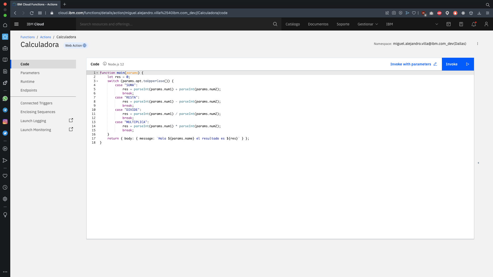

12. Ahora haremos una nueva prueba con el siguiente comando. En esta ocasión deberemos modificar varios tags `<URL>` pegando la URL de nuestra función, el `<nombre>` con nuestro nombre, `<operacion>` poniendo cualquiera de las siguiente **suma, resta, multiplica, divide** y por fin `<numero1>` y `<numero2>` asignando a cada uno un numero el que quieran.

```bash
curl -X POST "<URL>" -H 'Content-Type: application/json' -d '{"name":"<nombre>","opt":"<operacion>","num1":<numero1>,"num2":<numero2>}'
```

Después de editar los 5 tags le daremos enter y deberíamos obtener una respuesta así.

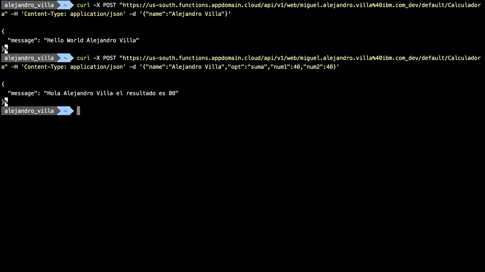

13.  Con esto terminamos la parte en donde editamos nuestra función ahora procederemos a crear nuestra API con API Gateway y conectar nuestra función a un path de este Gateway. Para hacer eso deberemos irnos de nuevo a la ventana de **Endpoints** y ahí le daremos click a el link que indica **API-KEY**.

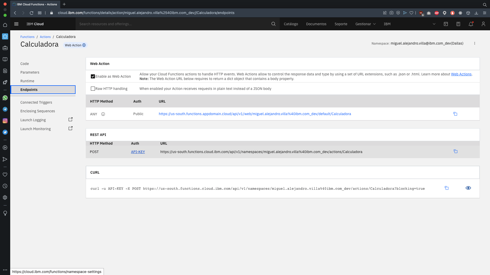

Eso nos llevará a otra pagina en la cual daremos click al lado izquierdo donde dice **API**.

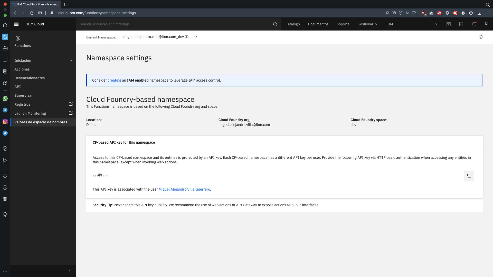

Ahora si estamos en la ventana que necesitábamos, debemos de dar click en el botón azul que dice **Crear API**.

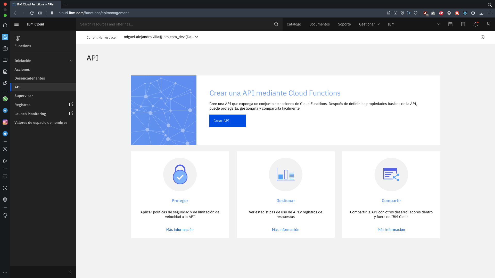

14. Nos llevará al formulario para crear nuestro API Gateway, para comenzar necesitaremos ponerle nombre a nuestra API la cual automáticamente nos generará la vía de acceso base de nuestra API. En este caso yo la definí como **Calculadora Cientifica**

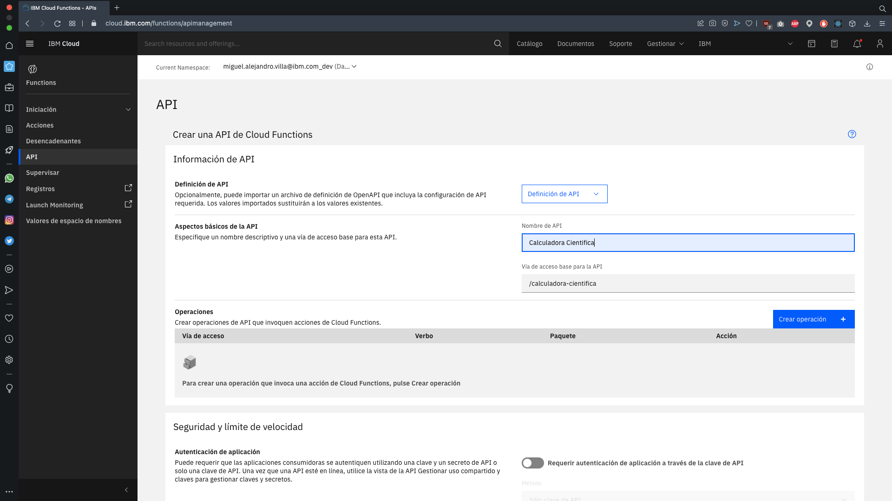

15. Lo siguiente es asignar un path para nuestra función para esto le daremos en el botón azul que dice **Crear operación** y nos abrirá un pop up donde podremos elegir la vía de acceso a nuestra función en ese caso le puse `/calculadora` para hacer referencia a lo que hace mi función, debemos también elegir el verbo que usará nuestra petición **GET,POST,PUT,DELETE,...** para esta ruta en especifico elegiremos **POST**, seleccionaremos el paquete **Predeterminado** el cual contiene nuestra función y deberemos elegir nuestra acción que en este caso es **Calculadora** para finalizar elegiremos **application/json** como tipo de contenido de respuesta para indicar que estaremos regresando JSON.  
 
Para finalizar esta parte le daremos al botón azul **Crear**.

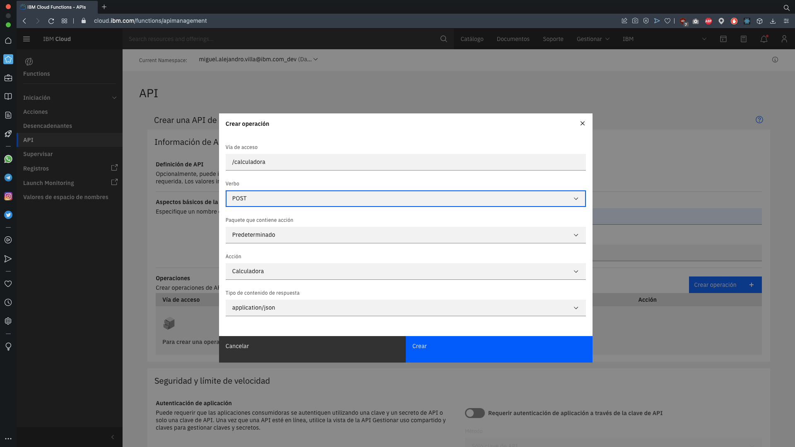

16. Debemos notar que una nueva operación fue agregada a nuestra lista.

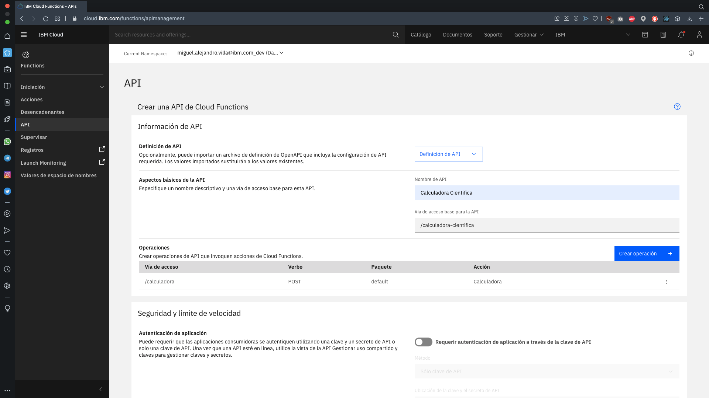

17. Para finalizar nuestra API le daremos scroll hasta abajo y daremos click al botón azul que indica **Crear**.

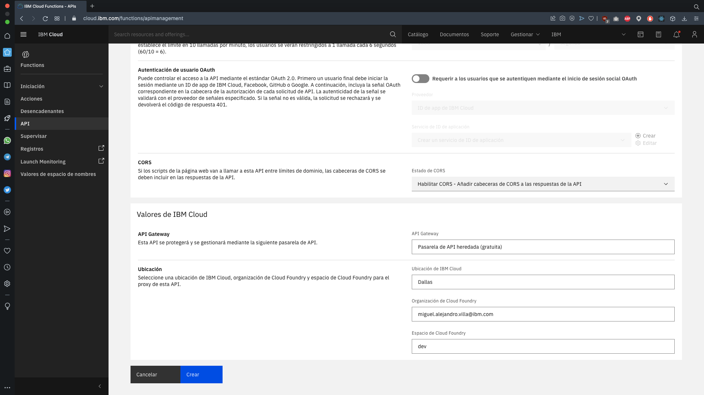

18. Nos redirigirá a una nueva ventana donde podremos ver la nueva ruta de nuestra función, pero ahora pasando primero por API Gateway, y veremos un dashboard donde nos mostrará el uso que le hemos dado a nuestra API.

Copiaremos la nueva ruta que nos ofrece.

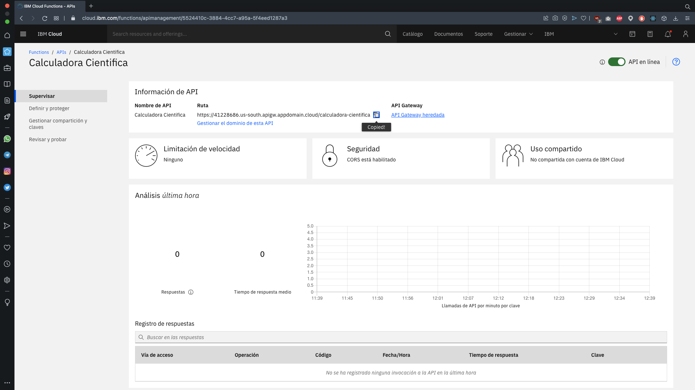

1.  Ahora haremos una nueva prueba con la nueva URL, deberemos usar el mismo comando para hacer la petición pero ahora necesitaremos también la vía de acceso que definimos al crear la API, al siguiente comando hay que cambiarle `<URL>` pegando la URL de nuestra API, el `<nombre>` con nuestro nombre, `<operacion>` poniendo cualquiera de las siguiente **suma,resta,multiplica,divide** y por fin `<numero1>` y `<numero2>` asignando a cada uno un numero el que quieran.

```bash
curl -X POST "<URL>/calculadora-cientifica/calculadora" -H 'Content-Type: application/json' -d '{"name":"<nombre>","opt":"<operacion>","num1":<numero1>,"num2":<numero2>}'
```

Después de editar los 5 tags le daremos enter y deberíamos obtener una respuesta así.

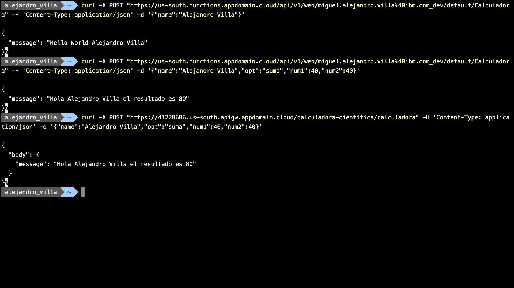
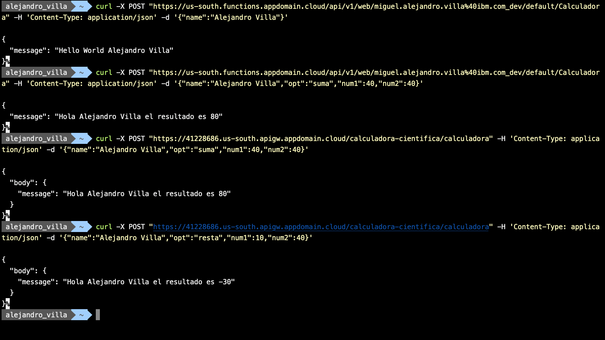

Con esto damos por terminado nuestro laboratorio.

## Lo que aprendimos fue: 
 - [x] Como crear una acción desde la interfaz web de IBM cloud
 - [x] Activar la función como una web action
 - [x] Conectar la función con API Gateway
 - [x] Hacer peticiones a nuestra API
 

